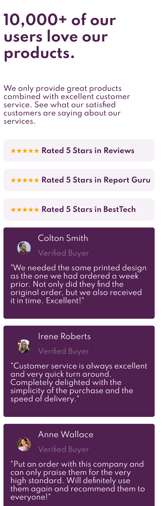

# Frontend Mentor - Social proof section solution

This is a solution to the [Social proof section challenge on Frontend Mentor](https://www.frontendmentor.io/challenges/social-proof-section-6e0qTv_bA). Frontend Mentor challenges help you improve your coding skills by building realistic projects. 

## Table of contents

- [Overview](#overview)
  - [The challenge](#the-challenge)
  - [Screenshot](#screenshot)
  - [Links](#links)
- [My process](#my-process)
  - [Built with](#built-with)
  - [What I learned](#what-i-learned)
  - [Continued development](#continued-development)
  - [Useful resources](#useful-resources)
- [Author](#author)
- [Acknowledgments](#acknowledgments)

## Overview

### The challenge

Users should be able to:

- View the optimal layout for the section depending on their device's screen size

### Screenshot

### Links

- Solution URL: (https://hmbjorkevoll.github.io/socialproof_frontendmentor/)

## My process
I started building the site with desktop in mind first. Found that to be frustrating when designing for mobile, and discarded all my css and started again with mobile-first. This went a lot better, but there are still a few minor issues with the design that I just can't nail down at this point in time.

### Built with

- CSS Grid
- Mobile-first workflow

### What I learned

I learned to use CSS grid, and specifically grid areas in a way that I was not used to before. Had to think hard about how to get the responsive design right, and it's about 98% there now. The last 2% is going to take too long for now, have to keep moving to a new project to learn at a more suitable pace.

### Continued development

I need top be able to place elements individually with more precision. Not yet at the point where I can place the ratings offset from each other. That's something I need to learn.
Additionally, the time this took was way too long if I was working on a real project, and experiences like this should make me faster when I move forward.

### Useful resources

- [CSS-Tricks](https://www.css-tricks.com) - This helped me with a lot of the CSS-styling and getting the responsiveness to the grid.
- [MDN Web Docs](https://developer.mozilla.org/) - This resource was also of great help to figure out the grid layout and the @media additions to the code.

## Author

- Website - [Hans Martin Bjørkevoll](https://github.com/hmbjorkevoll/)
- Frontend Mentor - [@hmbjorkevoll](https://www.frontendmentor.io/profile/hmbjorkevoll)
- Twitter - [@hmbjorkevoll](https://www.twitter.com/hmbjorkevoll)
